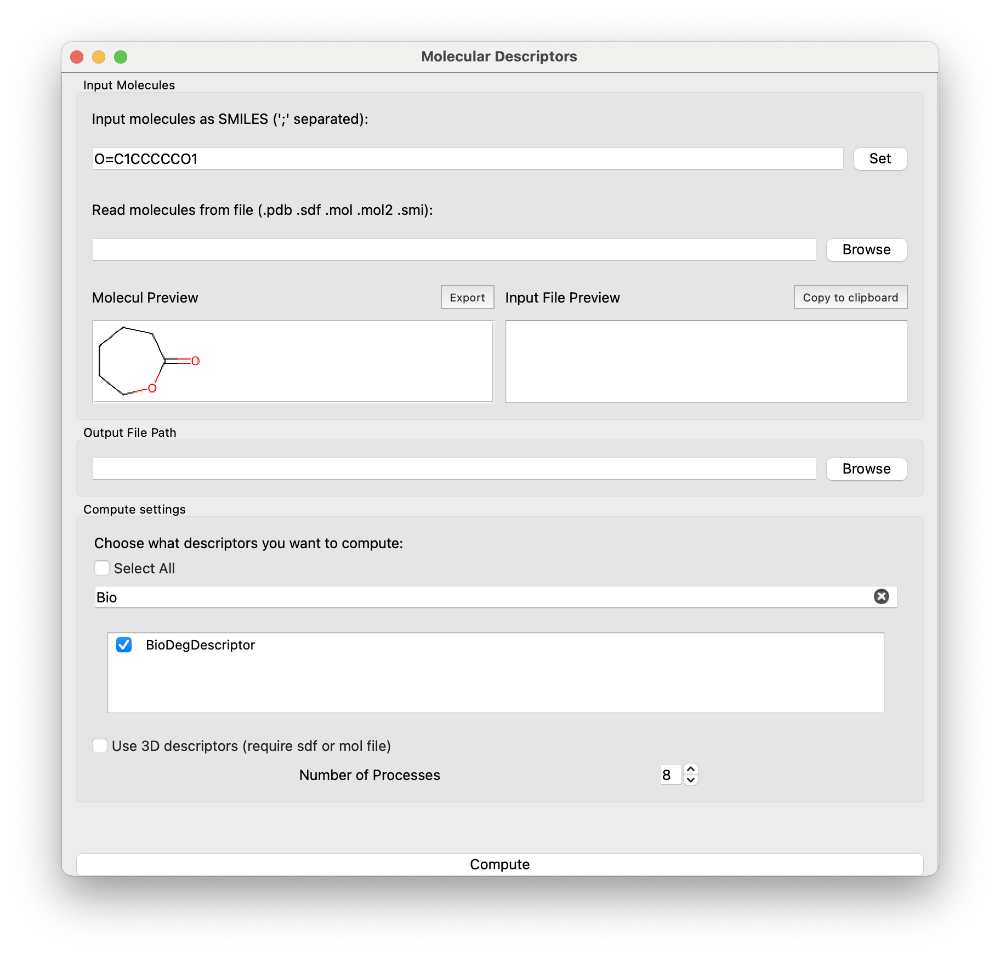

# Mordred-gui
Compute properties on molecules.


### Install
#### From source
```bash
conda create -n mordredgui python=3.11 && \
    conda activate mordredgui && \
    pip install .
```
### Developp
#### Install
```bash
conda create -n mordredgui python=3.11 && \
    conda activate mordredgui && \
    pip install -e . && \
    pip install poetry
```
#### Build
```bash
poetry build
```